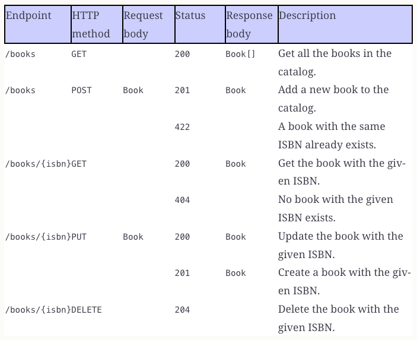
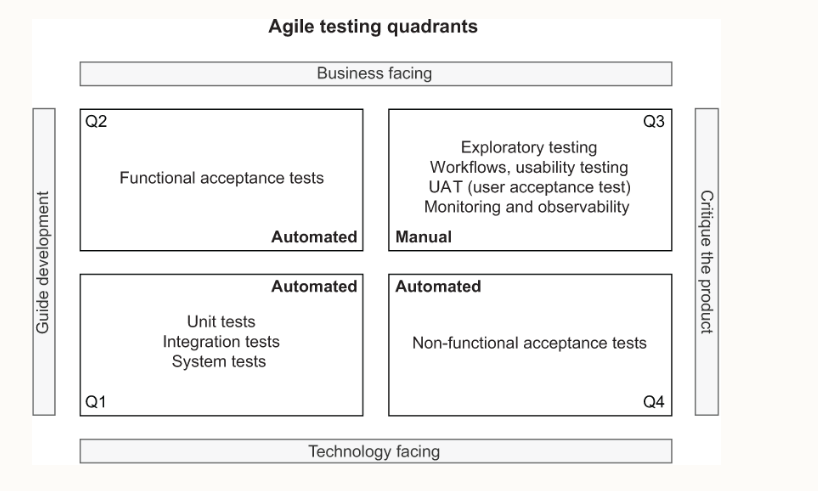

# Getting Started

`This project is based on Cloud Native Spring in Action by Thomas Vitale`

Define the domain and functionality of this project and what is it doing

## Catalog API contract

## Install Httppie for simple http cli based interactions

## ADD book in catalog
`http POST :8080/api/books author="Lyra Silverstar" \
title="Northern Lights" isbn="1234adsdsa"`

## GET book based on ISBN
`http GET :8080/api/books/1234567891`

## UPDATE book details 
`http PUT :8080/api/books/1234567891 author="Foozie" \
    title="Luxuries of being a Cat" price=9.90`

## DELETE book
`http DELETE :8080/api/books/1234567891`

# Agile Testing Quadrants

## Examples of unit testing
* [BookValidationTests.java](src/test/java/com/polarbookshop/catalogservice/domain/BookValidationTests.java)

## Examples of Integration Testing
Spring Boot offers a powerful @SpringBootTest annotation that you can use on a test class to bootstrap an application context automatically when running tests.
The configuration used to create the context can be customized if needed.
Otherwise, the class annotated with @SpringBootApplication will become the configuration source for component scanning and properties, including the usual auto-configuration provided by Spring Boot.
- When working with web applications, you can run tests on a mock web environment or a running server. You can configure that by defining a value for the web - Environment attribute that the @SpringBootTest annotation provides, as shown in table below.
- When using a mock web environment, you can rely on the `MockMvc` object to send HTTP requests to the application and check their results. 
- For environments with a running server, the `TestRestTemplate` utility lets you perform REST calls to an application running on an actual server. By inspecting the HTTP responses, you can verify that the API works as intended.

| **Web Environment Option** | **Description** |
| --- | --- |
| **MOCK** | Creates a web application context with a mock Servlet container. This is the default option. |
| **RANDOM_PORT** | Creates a web application context with a Servlet container listening on a random port. |
| **DEFINED_PORT** | Creates a web application context with a Servlet container listening on the port defined through the server.port property. |
| **NONE** | Creates an application context without a Servlet container. |

Have a look at this test case
[CatalogServiceApplicationTests.java](src/test/java/com/polarbookshop/catalogservice/CatalogServiceApplicationTests.java)

The `@SpringBootTest` annotated on the `CatalogServiceApplicationTests` class sets up the full application context and is utilized for testing Spring Boot applications. Specifically:
1. **Setup Application Context**: It initializes an entire Spring application context, including all beans, configurations, and any related auto-configuration.
2. **Web Environment**:
    - Here, the `webEnvironment = SpringBootTest.WebEnvironment.RANDOM_PORT` attribute specifies that an **embedded Servlet container** (e.g., Tomcat) should be spun up during the test on a **random port**.
    - The application runs within this server, similar to how it would execute in production, making it suitable for integration testing.

### Does it Spin a New Server?
Yes, the `SpringBootTest.WebEnvironment.RANDOM_PORT` spins up an embedded server at runtime. This is in contrast to `webEnvironment = MOCK`, where a mock environment is utilized (no actual server is spun up).
### Does the WebClient (`WebTestClient`) Hit the `BookController`?
Yes, the `WebTestClient` in this test hits the actual `BookController`.
1. The test sends an HTTP `POST` request to the `/api/books` endpoint.
2. Due to the server being started (`RANDOM_PORT`), the request is processed by the actual `BookController` within the application context.
3. The `BookController` processes the request as it does in a real runtime environment, interacts with any associated services or repositories, and sends back the response.
4. The `WebTestClient` validates the response against expectations, as shown in `whenPostRequestThenBookCreated`.

Since this is an integration test, it validates the full lifecycle of an HTTP request, including actual routing to the `BookController`, request body handling, and response generation.
### Summary of the Workflow in `whenPostRequestThenBookCreated`:
1. A new `Book` object is created and sent as the request body to `/api/books`.
2. The actual `BookController` processes the request, likely storing the `Book` or performing corresponding logic.
3. The test method `expectStatus().isCreated()` ensures that the response has an HTTP status `201 Created`.
4. The test further validates that the response contains a `Book` object and that the `isbn` matches the expected value.

This approach ensures that the `BookController` and its dependencies work together as expected in the real environment setup.

## Run a specific test
`./gradlew test --tests BookValidationTests`

## Examples of Slice Testing
Some integration tests might not need a fully initialized application context. 
For example, there’s no need to load the web components when you’re testing the data persistence layer. 
If you’re testing the web components, you don’t need to load the data persistence layer.

Spring Boot allows you to use contexts initialized only with a subgroup of components (beans), targeting a specific application slice. 
Slice tests don’t use the @SpringBootTest annotation, but one of a set of annotations dedicated to particular parts of an application: Web MVC, Web Flux, REST client, JDBC, JPA, Mongo, Redis, JSON, and others. 
Each of those annotations initializes an application context, filtering out all the beans outside that slice.

[BookControllerMvcTests.java](src/test/java/com/polarbookshop/catalogservice/web/BookControllerMvcTests.java)
MockMvc is a utility class that lets you test web endpoints without loading a server like tomcat.
Slice tests run against an application context containing only the parts of the configuration requested by that application slice. In the case of collaborating beans outside the slice, such as the BookService class, we use mocks
Mocks created with the @MockitoBean annotation are different from standard mocks (for example, those created with Mockito) since the class is not only mocked, but the mock is also included in the application context. 
Whenever the context is asked to autowire that bean, it automatically injects the mock rather than the actual implementation

## Testing JSON serialization with @JsonTest
The Book objects returned by the methods in BookController are parsed into JSON objects. By default, Spring Boot automatically configures the Jackson library to parse Java objects into JSON (serialization) and vice versa (deserialization).

Using the @JsonTest annotation, you can test JSON serialization and deserialization for your domain objects. @JsonTest loads a Spring application context and auto-configures the JSON mappers for the specific library in use (by default, it’s Jackson). 
Furthermore, it configures the JacksonTester utility, which you can use to check that the JSON mapping works as expected, relying on the JsonPath and JSONAssert libraries.

Note JsonPath provides expressions you can use to navigate a JSON object and extract data from it. 
For example, if I wanted to get the isbn field from the Book object’s JSON representation, I could use the following JsonPath expression: `@.isbn` 
For more information on the JsonPath library, you can refer to the project documentation: https://github.com/json-path/JsonPath.

## Grype for vulnerability scanning
https://github.com/anchore/grype

The tool will download a list of known vulnerabilities (a vulnerability database) and scan your project against them. 
The scanning happens locally on your machine, which means none of your files or artifacts is sent to an external service. 
That makes it a good fit for more regulated environments or air-gapped scenarios.

$ grype .

### Reference Documentation

For further reference, please consider the following sections:

* [Official Gradle documentation](https://docs.gradle.org)
* [Spring Boot Gradle Plugin Reference Guide](https://docs.spring.io/spring-boot/3.4.4/gradle-plugin)
* [Create an OCI image](https://docs.spring.io/spring-boot/3.4.4/gradle-plugin/packaging-oci-image.html)

### Additional Links

These additional references should also help you:

* [Gradle Build Scans – insights for your project's build](https://scans.gradle.com#gradle)

### docker compose 
docker-compose -f docker-compose.yml up

### sdkman commands
sdk env install --> installs the java and gradle versions based on .sdkmanrc and the current shell points to those versions
sdk env  --> the current shell points to those versions
sdk list java/gradle --> lists different java/gradle versions 
sdk install java <specific java identifier>
sdk install gradle <specific gradle identifier>

### postman collection for local testing
under directory postman
